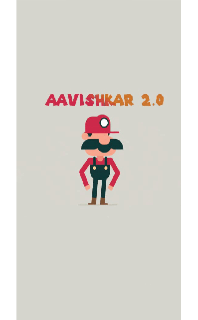

# Aavishkar App
Official Andriod and IOS Application for the Technical Fest of National Institute Of Technology, Durgapur - Aavishkhar 2.0  

# Requirements:  
1. Andriod Studio.
2. Flutter Plugin, for help refer [Flutter Docs](https://flutter.dev/docs/get-started/install)
3. Emulator/ Andriod/ Ios Device.

# Running the Application:  
1. Open the project in Andriod Studio.  
2. Run emulator or connect a phone.  
3. Build project on emulator/phone.  
For help getting started with Flutter, view online documentation.  
